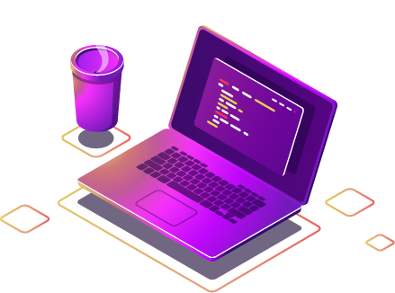
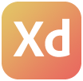
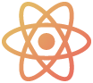
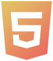
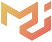

<h1 align="center">What's up my friends </h1>

 
 

 
 
 

  I'm <strong>Andrei Deholte</strong>, enthusiast of the best web. I'm a tech lead at SulAmérica company.

 

- 🚀 I'm currently working at Sulamérica
- 🔭 Always open to discover new things
- 📫 How to reach me: [My Linkedin](https://www.linkedin.com/in/andreideholte), [My E-mail](andreideholte@gmail.com)
- 💬 Ask me about anything
- ⚽ Fun fact: Almost professional football player

 
 
 

  
  
  
  
  
  
  &nbsp;&nbsp;&nbsp;
  
  
  
  
  
  
  
  
  
  &nbsp;&nbsp;&nbsp;
  

